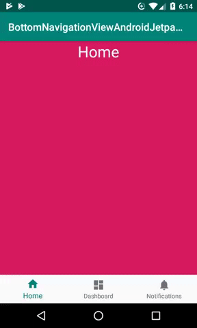

# Bottom NavigationView Android Jetpack

Simple BottomNavigationView using the Android Jetpack library with Navigation Architecture Component

## Getting Started
### Using Git Bash
```
git clone git@github.com:MurilloComino/androidx-bottom-navigation-view.git
```

### Using Android Studio
```
in File > New > Project from Version Control... > git

in URL put: https://github.com/MurilloComino/androidx-bottom-navigation-view.git

and then clone
```

## Installing
* Connect via usb your android phone.
* After cloning the project, open the terminal and navigate to the root folder.

#### Windows
````
gradlew installDebug
````
#### Linux & MacOS
````
./gradlew installDebug
````

## Example


## Built With

* [Android Studio 3.5](https://developer.android.com/studio) - The IDE used

## License

* [Apache License 2.0](LICENSE.md)